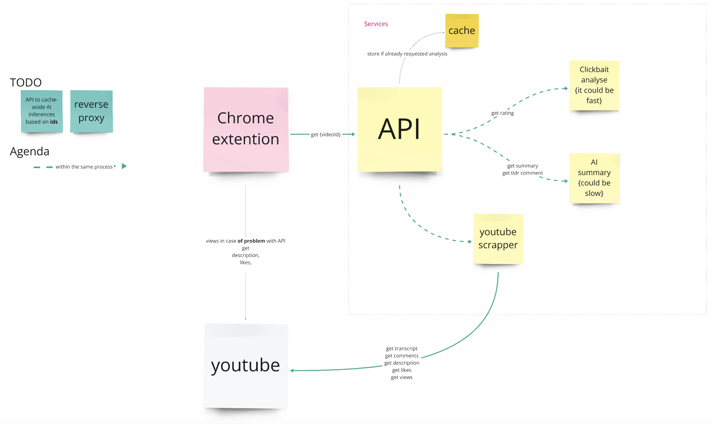

AI Video Insight - Google Chrome Extension
---

# Could it be improved?
- frontend <-> backend interaction improve: e.g. frontend -> send video id (or id), then checking API if each part of summary 
is ready, ratio is ready, etc.
- send video ids to make backend preload all desirable info (~~refresh-ahead~~ cache-ahead), then get as soon as ready.
- caching: {on API level, for data fetching concurrent process}
- add simple gridy arch: use different models (+ locally deployed) and return fisrt answer available (with e.g. asyncio.FIRST_COMPLETED)

# Solution Architecture


# Develop Locally
First of all **git clone** and get your **OpenAI API key**, also note that to run backend you need **docker** & **docker compose** installed

## Backend
1. Prepare env according to `.env.example` in deploy folder.

2. 
```bash
cd deploy
docker compose up --build
```

you could check that it is running by going to `http://localhost:8000/docs` in your browser.

## Google Chrom Extension
1. Turn dev mode in browser.
2. Go to manage Extensions, press `Load unpacked` and choose `[chrome-extention](chrome-extention)` folder.


# ToDo
- [ ] # TODO: api could rely on user open token rather than on centralised token.
- [ ] tests
- [ ] add info about votes from comments to AI.
- [ ] youtube info fetchers consists of blocking code (not python async compatible)